# Introduction

!!! note

    The PODS is currently in a drafting stage. Comments and suggestions
    are [welcome](https://github.com/pagasa-parser/pods/discussions),
    and the specification is subject to change.

The Philippine Open Disaster Specification (PODS) is a specification for
describing disaster-related data in the Philippines. Its development
arises from the need to centralize and standardize the multitude of
reports and systems used by Philippine government agencies for easy
repackaging and distribution.

## Rationale

As of writing (January 2024), there exists no standard specification for
describing natural disasters occurring within the Philippines. Given the
prevalence of natural disasters in the country, particularly typhoons,
earthquakes, and volcanic eruptions, there is a need to provide a standard
specification to ease dissemination of information to the public.

The goal is to design a specification that includes the most common factors
in disaster events, and to ensure that it is extensible to provide more
information as needed.

**PODS is not meant to replace official reports.** Rather, it should derive
its information from reputable sources (e.g. PAGASA, PHIVOLCS, NDRRMC,
including USGS, ESMC, and other international agencies) and provide a
bundle of information that can then be consumed by anyone who needs it,
be it an app installed on a civilian phone or non-governmental organizations.

## Contribution

This specification is open for comments, suggestions, revisions, and more.
If you have any ideas on how to improve the specification, please feel free
to file an issue or discussion on the specification GitHub repository.

## License

This specification documentation is licensed under the [Creative Commons
Attribution-ShareAlike 4.0 International License](https://creativecommons.org/licenses/by-sa/4.0/).

Machine-readable specification files, such as JSON Schema files and TypeScript
interface and type defintions, are licensed under the [Apache License
2.0](https://www.apache.org/licenses/LICENSE-2.0).
